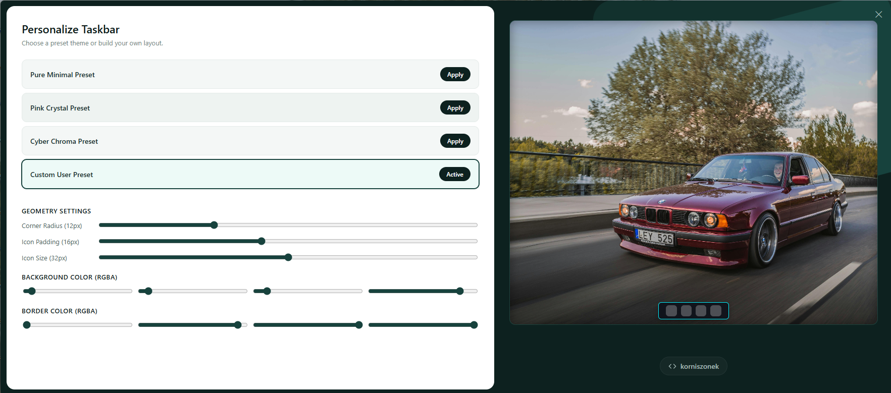
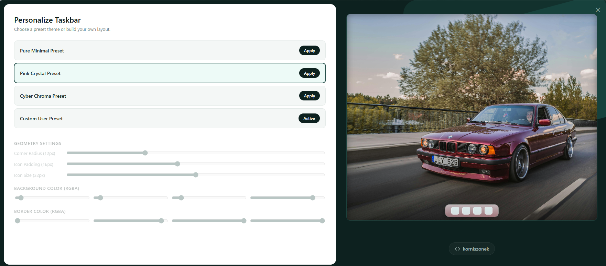
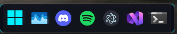

## Windows 11 Styles Manager

Windows 11 Styles Managaer is an app which allows You to change your taskbar style.

---

## Pre - Load Styles:

- Pink Crystal - subtle pink Taskbar.
- Pure Minimalist - clean and quiet Style.
- CyberChroma - Black Taskbar with Neon border.
- UserStyle - customizible Taskbar.

## UI:

- Windows 11 Styles Manager comes with an UI desktop app which allows You to avoid injecting DLLs via terminal.







---

## Stack used in solution

### UI
 - Electron (desktop app shell)
 - React (components)
 - TypeScript (connection, handling functionality)
 - Node.js ( wireing the project and managing JS libaries)
 - Node Package Manager ( instaling and managing JS dependencies)
 - Koffi (handling C++ dll connection)

### Injection
 - C++ (injecting Dll files into Explorer process)
 - Dwm api (managing windows styles)
 - GDI+ (refatoring icons and taskbar styles)
 - Nlohmann/json (parsing json files from UI)

---

## How does it work:
 - C++ handles injecting into Explorer process by finding process id, it provides custom dll with own Taskbar component - which is better than using predefined one, because Windows does not allows to modify and access many functions defined in dwmapi, even if You give a administrator permision for app (You can check that by building an old version from my first commits).

 - It creates a hIsland object of class HWND and defines it as a taskbar, which is fully customizable from UI level.

 - UI connects to TaskbarEffects dll by Koffi libary, witch works as a pipe to injector ordering and managing taskbar hIsland styles.

---

## Setup

### What you need beffore:
 - MSVC v143 or other on go C++ compiler ( i`ve used this one)
 - Node.js (for ui)
 - Node Package Manager (npm) (for installing ui dependencies)

### Cloning git repo
```bash
git clone https://github.com/korniszonek/Windows11StylesCustomizer
cd Windows11StylesCustomizer
```
### Seting up UI
```bash
cd taskbar-ui
npm install
```
### Running UI
```bash
npm start
```
---
Author: Karol Korc
